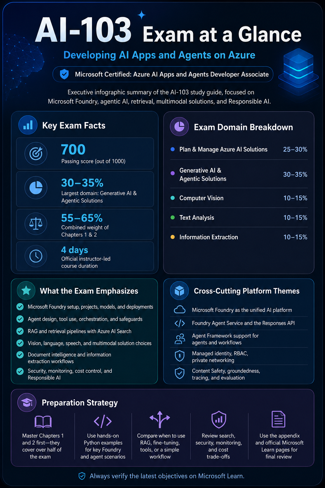
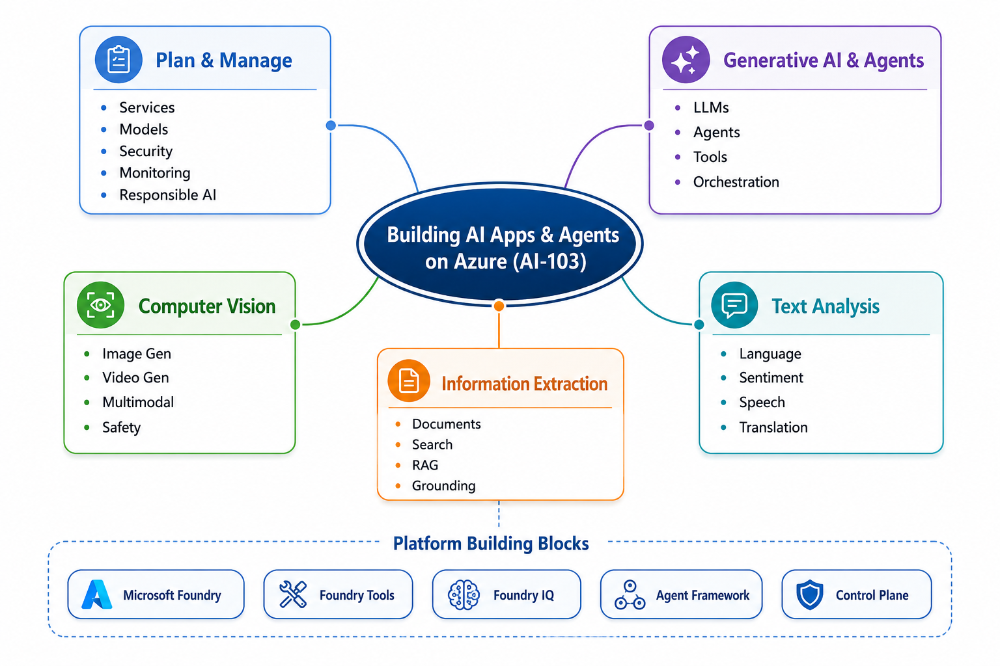

# AI-103 Study Notes

## Developing AI Apps and Agents on Azure

This repository contains my personal study notes for **Exam AI-103: Developing AI Apps and Agents on Azure**.

I created it while preparing for the **Microsoft Certified: Azure AI Apps and Agents Developer Associate** certification and working through Microsoft Foundry, generative AI apps, agents, retrieval-augmented generation, Azure AI Search, multimodal AI, language services, document intelligence, and Responsible AI topics.

The purpose of this repo is simple: turn the official AI-103 objectives into practical, readable, exam-focused notes that I can use for revision and hands-on practice.

---

## Online Version

A browser-friendly version of this study guide is published on my website:

**[Azure AI-103 Exam Study Guide: Developing AI Apps and Agents on Azure](https://sokolovtech.com/management/134-azure-ai-103-exam-study-guide-developing-ai-apps-and-agents-on-azure)**

Use the website version when you want to read the guide as a formatted article.

Use this GitHub repository for the markdown source, chapter structure, visual summaries, updates, and possible future lab examples.

---

## Acknowledgements

This repository was inspired by the public AI-103 study guide created by **Pratip Bagchi**:

* [pratip-bagchi/ai-103-study-guide](https://github.com/pratip-bagchi/ai-103-study-guide)

Thank you to the original author for sharing a useful starting structure for AI-103 preparation.

This repository has been rewritten and reorganized as my own study version, with updated wording, additional notes, revised visuals, Microsoft Learn links, and my own exam-focused explanations. Any mistakes or outdated information in this repo are my own.

---

## Official Microsoft Links

Microsoft Learn and Microsoft certification pages should always be treated as the source of truth.

* [Exam AI-103 study guide](https://learn.microsoft.com/en-us/credentials/certifications/resources/study-guides/ai-103)
* [Microsoft Certified: Azure AI Apps and Agents Developer Associate](https://learn.microsoft.com/en-us/credentials/certifications/azure-ai-apps-and-agents-developer-associate/)
* [AI-103T00-A: Develop AI apps and agents on Azure](https://learn.microsoft.com/en-us/training/courses/ai-103t00)
* [Microsoft Foundry documentation](https://learn.microsoft.com/en-us/azure/foundry/)
* [What is Microsoft Foundry?](https://learn.microsoft.com/en-us/azure/foundry/what-is-foundry)
* [Get started with AI applications and agents on Azure](https://learn.microsoft.com/en-us/training/paths/get-started-ai-apps-agents/)
* [Develop AI agents on Azure](https://learn.microsoft.com/en-us/training/paths/develop-ai-agents-azure/)

Microsoft updates exam objectives and Azure AI services regularly, so check the official AI-103 study guide before booking or sitting the exam.

---

## Visual Overview

The repository includes a one-page visual summary of the exam structure and main study areas.



This image is intended as a quick revision aid before going into the detailed chapter notes.

---

## Mind Map

A mind map is also included to show how the AI-103 domains connect across planning, agents, vision, language, information extraction, and platform building blocks.



---

## What This Repo Covers

AI-103 is not only about memorising Azure AI service names. A lot of the exam preparation is about understanding when to use a specific Azure service, model, design pattern, or safety control.

The notes cover:

* Microsoft Foundry
* Generative AI applications
* Agentic AI solutions
* Retrieval-augmented generation
* Azure AI Search
* Computer vision
* Text analysis
* Speech services
* Document intelligence
* Information extraction
* Responsible AI
* Security, monitoring, governance, and cost control

---

## Repository Structure

```text
ai-103-study-guide/
├── Chapter1-PlanManage.md
├── Chapter2-GenerativeAgents.md
├── Chapter3-ComputerVision.md
├── Chapter4-TextAnalysis.md
├── Chapter5-InformationExtraction.md
├── Appendix-Resources.md
└── images/
    ├── exam-at-glance.png
    └── ai-103-mindmap.png
```

> Note: GitHub paths are case-sensitive. If your folder is named `ai-103-study-guide` instead of `AI-103-StudyGuide`, update the links in this README to match the actual folder name.

---

## Chapter Index

### Chapter 1 — Plan and Manage an Azure AI Solution

**Official exam weighting: 25–30%**

This chapter covers the foundation of an Azure AI solution:

* Choosing the right Azure AI service
* Planning Microsoft Foundry resources
* Selecting models and deployment options
* Managing quotas, capacity, and cost
* Applying identity and access control
* Monitoring AI applications
* Planning CI/CD for AI workloads
* Applying Responsible AI controls

[Open Chapter 1](./ai-103-study-guide/Chapter1-PlanManage.md)

---

### Chapter 2 — Implement Generative AI and Agentic Solutions

**Official exam weighting: 30–35%**

This is the largest AI-103 domain and the area I expect to spend the most time on.

Topics include:

* Prompt design
* Generative AI application patterns
* Retrieval-augmented generation
* Grounding with enterprise data
* Function calling and tool use
* Agent design
* Multi-agent patterns
* Knowledge sources
* Fine-tuning considerations
* Evaluation and optimization

[Open Chapter 2](./ai-103-study-guide/Chapter2-GenerativeAgents.md)

---

### Chapter 3 — Implement Computer Vision Solutions

**Official exam weighting: 10–15%**

This chapter covers image, video, and multimodal AI scenarios.

Topics include:

* Image analysis
* Video and visual content processing
* Multimodal model use cases
* Image generation concepts
* Visual content safety
* Choosing between vision models, OCR, and document processing

[Open Chapter 3](./AI-103-StudyGuide/Chapter3-ComputerVision.md)

---

### Chapter 4 — Implement Text Analysis Solutions

**Official exam weighting: 10–15%**

This chapter focuses on language and speech capabilities.

Topics include:

* Language detection
* Sentiment analysis
* Key phrase extraction
* PII detection
* Translation
* Speech-to-text
* Text-to-speech
* Speech-enabled AI applications and agents

[Open Chapter 4](./ai-103-study-guide/Chapter4-TextAnalysis.md)

---

### Chapter 5 — Implement Information Extraction Solutions

**Official exam weighting: 10–15%**

This chapter covers extracting, indexing, and retrieving knowledge from documents and data sources.

Topics include:

* Azure AI Document Intelligence
* OCR
* Structured document extraction
* Azure AI Search
* Indexing and enrichment pipelines
* Vector search
* Hybrid search
* Semantic ranking
* Grounding generative AI responses with search results

[Open Chapter 5](./ai-103-study-guide/Chapter5-InformationExtraction.md)

---

### Appendix — Resources and Exam Tips

The appendix contains supporting resources for final review.

Topics include:

* Mind map
* Useful Microsoft Learn links
* Exam preparation notes
* Quick revision reminders
* Final readiness checklist

[Open Appendix](./ai-103-study-guide/Appendix-Resources.md)

---

## Suggested Study Order

My preferred study order is:

1. Start with **Chapter 1** to understand the platform, planning, management, security, and governance topics.
2. Spend the most time on **Chapter 2**, because generative AI and agentic solutions are the largest domain.
3. Study **Chapter 5** early, because retrieval, search, and grounding appear in many generative AI scenarios.
4. Use **Chapters 3 and 4** to cover vision, language, and speech workloads.
5. Finish with the **Appendix** and revisit the official Microsoft study guide before the exam.

---

## Questions I Use for Exam Practice

These are the design questions I keep coming back to while studying:

* Should this solution use RAG, fine-tuning, prompt engineering, tool use, or a combination?
* Is an agent really needed, or would a normal workflow be safer and simpler?
* Which Azure AI service is the best fit for this task?
* What data needs to be indexed, chunked, embedded, or filtered?
* How should the application authenticate to Azure services?
* How should agent tools be restricted?
* How can the solution reduce hallucinations?
* How should AI output quality and safety be evaluated?
* How do cost, latency, reliability, and security affect the architecture?
* What Responsible AI controls are required?

---

## Responsible AI Focus

Responsible AI is not a separate side topic for AI-103. It appears across planning, generative AI, agents, vision, language, search, and information extraction.

Important areas include:

* Content filtering and safety systems
* Prompt injection protection
* Grounded responses
* Source citation and traceability
* Human review for high-risk outputs
* Secure tool access
* Privacy and data protection
* Monitoring and auditing
* Evaluation of quality, safety, and reliability

For AI-103, the goal is not only to know how to build AI apps. You also need to understand how to build them safely, securely, and responsibly.

---

## Useful Microsoft Learn Resources

* [Microsoft Foundry documentation](https://learn.microsoft.com/en-us/azure/foundry/)
* [Microsoft Foundry models](https://learn.microsoft.com/en-us/azure/foundry/foundry-models/)
* [Azure AI Search documentation](https://learn.microsoft.com/en-us/azure/search/)
* [Azure AI Document Intelligence documentation](https://learn.microsoft.com/en-us/azure/ai-services/document-intelligence/)
* [Azure AI Language documentation](https://learn.microsoft.com/en-us/azure/ai-services/language-service/)
* [Azure AI Vision documentation](https://learn.microsoft.com/en-us/azure/ai-services/computer-vision/)
* [Azure AI Speech documentation](https://learn.microsoft.com/en-us/azure/ai-services/speech-service/)
* [Azure AI Content Safety documentation](https://learn.microsoft.com/en-us/azure/ai-services/content-safety/)
* [Azure AI Foundry Agent Service documentation](https://learn.microsoft.com/en-us/azure/foundry/agents/)

---

## Notes About Accuracy

This repo is based on my own study notes, hands-on practice, Microsoft Learn, public Microsoft documentation, and ideas refined while reviewing other public AI-103 preparation material.

Azure AI changes quickly. Microsoft Foundry, model availability, SDKs, agent capabilities, and exam objectives can change over time. I try to keep the notes current, but always verify critical details against the official Microsoft documentation.

---

## Contributions

This is mainly a personal study repository, but corrections and suggestions are welcome.

Open an issue or pull request if you find:

* Broken links
* Outdated Microsoft service names
* Incorrect exam objective mapping
* Unclear explanations
* Useful examples or labs worth adding

---

## Disclaimer

This is an unofficial study repository.

It is not endorsed by Microsoft and does not replace the official AI-103 exam guide, Microsoft Learn, hands-on labs, or product documentation.

The repository was inspired by the structure of another public AI-103 study guide, but the notes, wording, visuals, and updates here are maintained as my own study version.

Always check the original repository license before copying or reusing any material from other public repositories.

---

## Final Note

AI-103 is about more than knowing individual Azure AI services.

The exam expects you to understand how to design useful, secure, grounded, and responsible AI applications on Azure.

Build small examples, compare architecture options, and focus on the reasoning behind each design choice.
